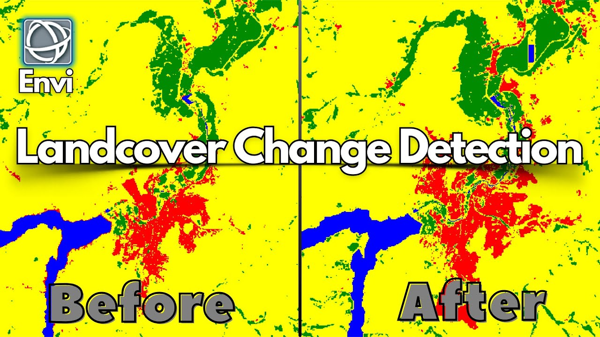

```{r setup, include=FALSE}
options(htmltools.dir.version = FALSE)
library(knitr)
library(xaringanExtra)

xaringanExtra::use_tile_view()
xaringanExtra::use_search(show_icon = TRUE)
```

# Summary: What is Landsat?

The Landsat program is the longest-running enterprise for the acquisition of satellite imagery of Earth.

* It is a joint initiative between NASA and the United States Geological Survey (USGS).
* The first satellite was launched in 1972.
* Currently, Landsat 8 and Landsat 9 are the primary operational satellites in orbit.

**Core Advantages:**
1. Provides continuous historical data with global coverage.
2. Implemented a free and open data policy since 2008.

---

# Summary: OLI Sensor Band Parameters

Landsat 8/9 are equipped with the **Operational Land Imager (OLI)**, which captures surface information across various spectral bands. Below are the parameters for some of the core bands:

```{r echo=FALSE}
band_data <- data.frame(
  Band = c("Band 2 (Blue)", "Band 3 (Green)", "Band 4 (Red)", "Band 5 (NIR)"),
  Wavelength = c("0.45 - 0.51 µm", "0.53 - 0.59 µm", "0.64 - 0.67 µm", "0.85 - 0.88 µm"),
  Resolution = c("30 m", "30 m", "30 m", "30 m")
)
knitr::kable(band_data, format = 'html')
```

---
class: inverse, center, middle

# "Opening the Archive: How Free Data Has Enabled the Science and Monitoring Promise of Landsat"
### - Wulder et al. (2012)
*(The Landsat free data policy fundamentally changed the trajectory of remote sensing science)*

---

# Summary: Common Spectral Indices (NDVI)

Multispectral data from Landsat is frequently used to calculate various vegetation indices, the most famous being the Normalized Difference Vegetation Index (NDVI). The formula is as follows:

$$NDVI = \frac{NIR - Red}{NIR + Red}$$

Applied specifically to Landsat 8 bands, the formula becomes:

$$NDVI = \frac{Band 5 - Band 4}{Band 5 + Band 4}$$

---

# Application: Monitoring Urban Expansion

Landsat imagery is widely used to monitor Land Cover Change.

```{r echo=FALSE, out.width='65%', fig.align='center'}

```

---

# Application: Urban Heat Island (UHI) 

.pull-left[
**Background & Objectives**
* As cities expand rapidly, natural vegetation is replaced by impervious surfaces.
* This leads to the severe **Urban Heat Island (UHI)** effect.
* Researchers require large-scale, historical data to evaluate the effectiveness of policy interventions.
]

.pull-right[
**The Value of Landsat**
* In addition to the OLI sensor, Landsat is equipped with the Thermal Infrared Sensor (TIRS).
* It can be used to retrieve **Land Surface Temperature (LST)**.
* Combined with the 30m resolution optical bands, it can accurately map different functional zones within a city.
]

---

# Reflection: Thoughts and Learning Outcomes

Through studying Landsat, I have come to deeply appreciate the power of longitudinal temporal data.

--

* **The Power of Open Source**: Landsat's greatest contribution is perhaps not just its hardware, but the free data policy of 2008, which fueled an explosion in global remote sensing applications.

--

* **Limitations**: While the 30m spatial resolution is excellent for regional-scale analysis, it remains insufficient for extracting individual buildings or fine-grained urban street features.

--

* **Future Prospects**: Moving forward, fusing Landsat data with higher-resolution satellites (like Sentinel-2) or radar data (Sentinel-1) to build denser time series will be the mainstream trend in urban remote sensing.

---

# References

* Loveland, T. R., & Dwyer, J. L. (2012). Landsat: Building a strong future. *Remote Sensing of Environment*, 122, 22-29.
* Wulder, M. A., Masek, J. G., Cohen, W. B., Loveland, T. R., & Woodcock, C. E. (2012). Opening the archive: How free data has enabled the science and monitoring promise of Landsat. *Remote Sensing of Environment*, 122, 2-10.